<p align="center">  </p>

</p>
<div align="center">
  <h1>README Architect</h1>
  <p><strong>Craft professional README files in minutes – with templates, snippets, snaps, and AI.</strong></p>
  <p>
    <a href="#features">Features</a> •
    <a href="#quick-start">Quick Start</a> •
    <a href="#snaps--personal-snippet-library">Snaps</a> •
    <a href="#ai-panel--readme-quality-score">AI Panel</a> •
    <a href="#project-structure">Project Structure</a>
  </p>
</div>

---

## Overview

README Architect is a specialized Markdown workspace for building high‑quality `README.md` files.  
Instead of fighting with raw Markdown in a basic editor, you get:

- A focused **split‑view Markdown editor + live preview**
- A large catalog of **ready‑made templates** for popular stacks
- Hundreds of **snippets** for tables, alerts, badges, GitHub stats, sections, and more
- A **Snaps system** to save and reuse your own favorite paragraphs
- An integrated **AI assistant** that scores and rewrites your README

The goal: turn README writing from a boring chore into a fast, repeatable, and enjoyable workflow.

---
## Themes
| Preview 1 | Preview 2 |
|---|---|
| 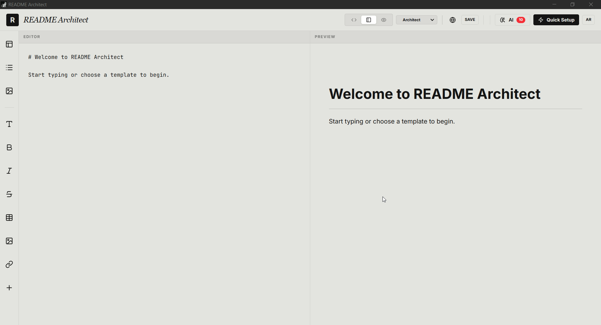 | 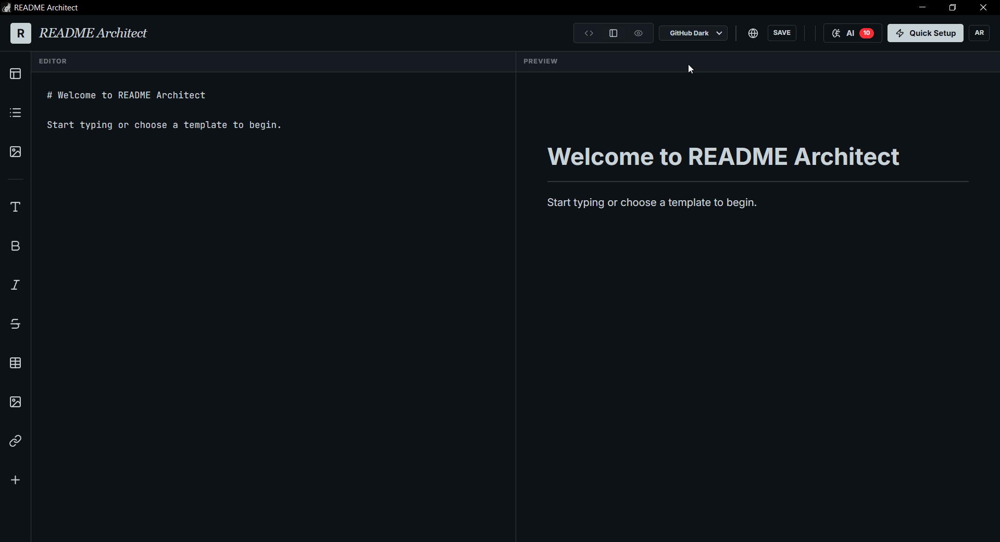 |
| 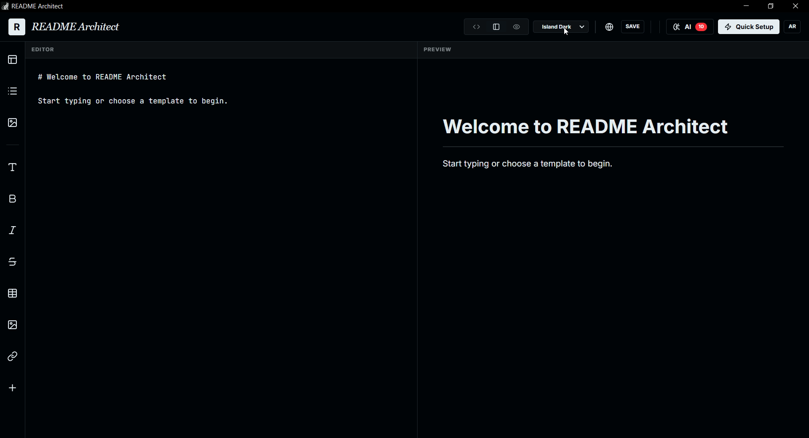 | 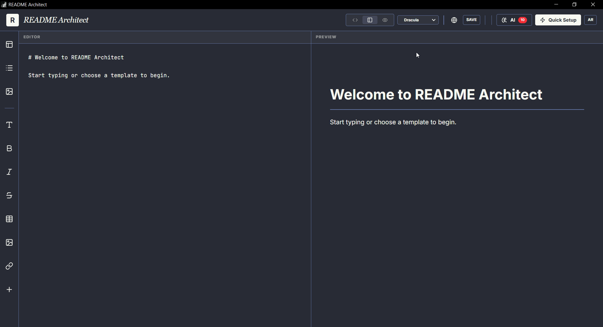 |
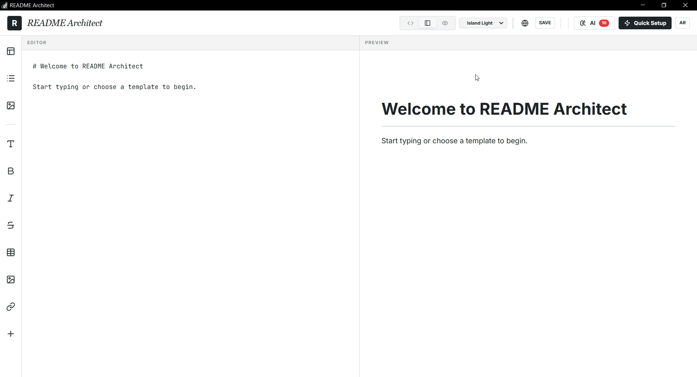

## Interface
| Preview 1 | Preview 2 |
|---|---|
| 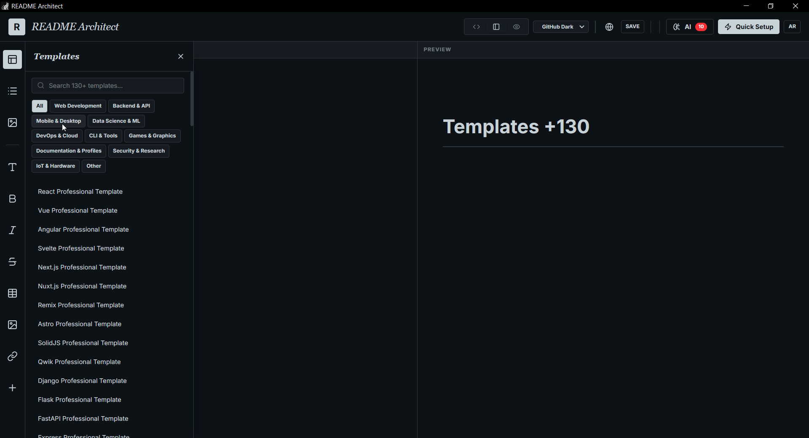 | 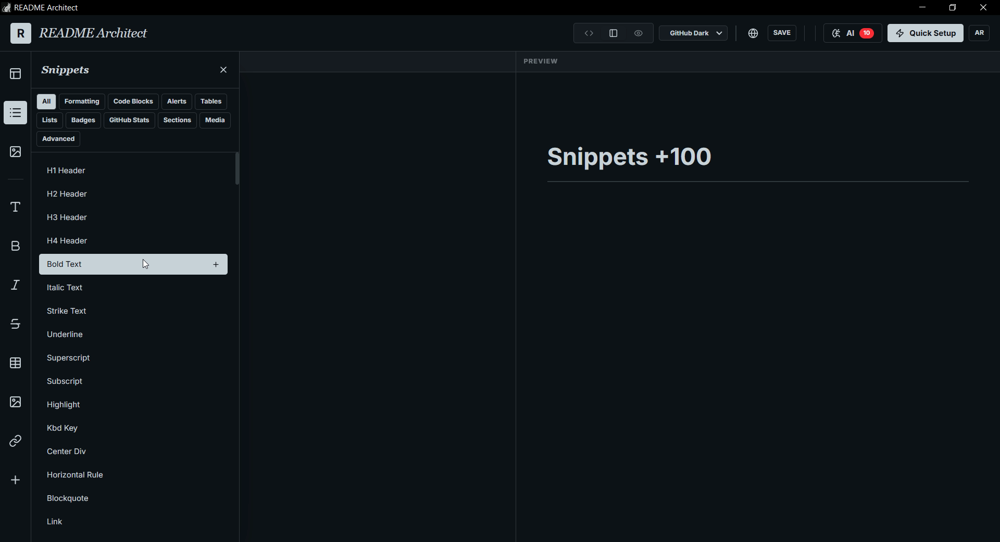 |
| 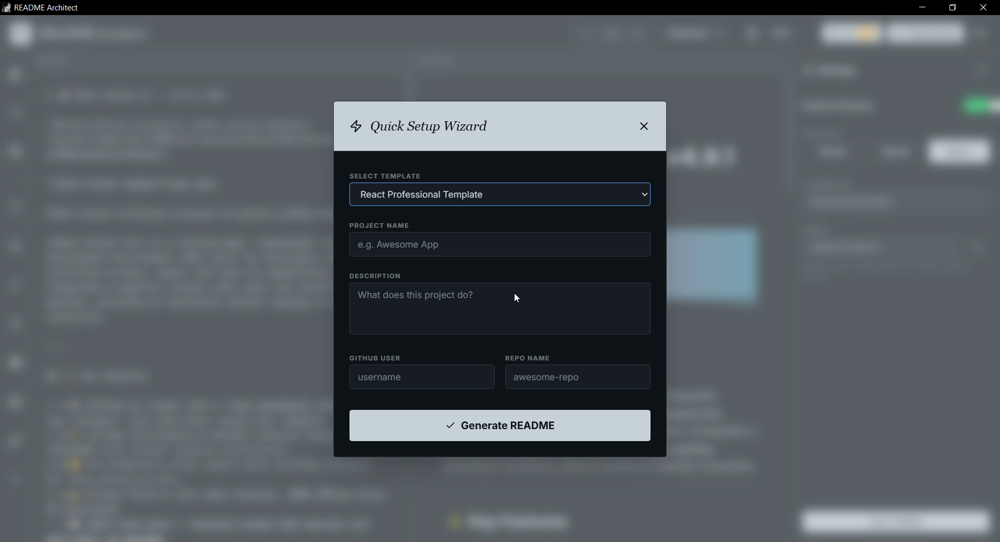 | 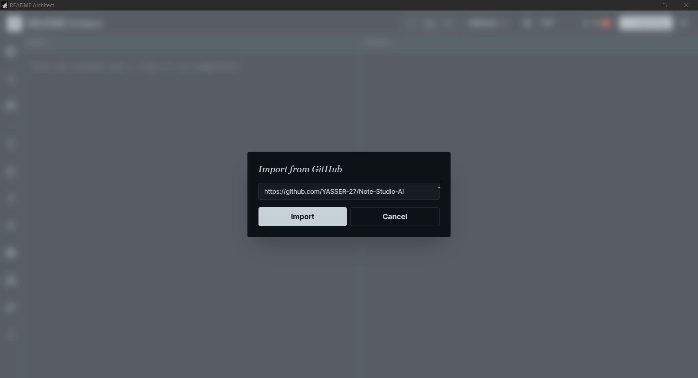 |

**AI**
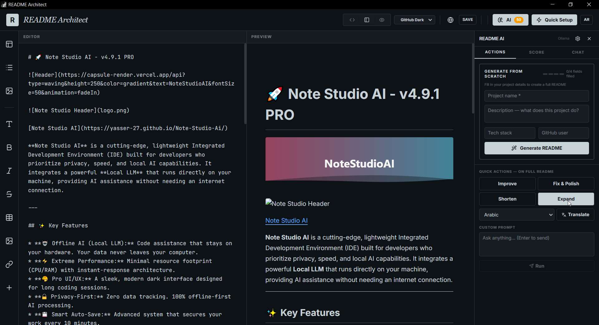
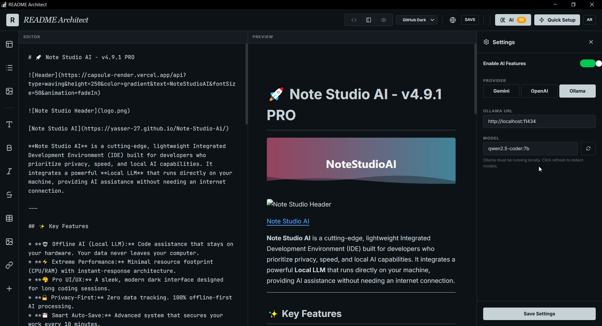

---
## VIDEO

https://github.com/user-attachments/assets/16d45c17-d56d-4bb8-a5d0-8d6563242592

https://github.com/user-attachments/assets/3edee07a-5f76-4298-b34f-87ebd0d11c1c

https://github.com/user-attachments/assets/5a806a97-1848-4ec2-a100-e02820fc7fd4

https://github.com/user-attachments/assets/0035de2b-9b83-41fe-a49f-3876340ebcbf

---
## Features

### Editor & Live Preview

- **Two‑pane layout**: Markdown editor on the left, rendered preview on the right.
- **GitHub‑style rendering** powered by:
  - `react-markdown`
  - `remark-gfm` (GitHub Flavored Markdown)
  - `rehype-raw` + `rehype-highlight` for inline HTML + syntax highlighting.
- **Themes**:
  - Architect
  - GitHub Dark
  - Island Dark
  - Dracula
  - Island Light
- **Keyboard shortcuts**:
  - `Ctrl + S` / `Cmd + S` – Save current README (and update the visual “SAVE” indicator).
  - `Ctrl + F` / `Cmd + F` – Save a selected snippet as a Snap (works with any keyboard layout).
- **Smart image handling**:
  - Drag & drop images into the editor.
  - In Electron, images are saved into a local `images/` folder and a Markdown reference is inserted automatically.

### Templates Panel

The Templates panel gives you a starting point instead of a blank page.

- 100+ **auto‑generated templates** for:
  - Web frameworks (React, Vue, Next.js, Svelte, Angular, etc.)
  - Backend frameworks (Django, Flask, FastAPI, Express, NestJS, Laravel, Rails, Spring Boot, etc.)
  - Mobile / desktop, DevOps, Data Science & ML, Games, Bots, Extensions, and more.
- Each template includes:
  - Title and short description
  - Badges (License, Version)
  - Sections for Features, Tech Stack, Installation, Usage, Screenshots, Contributing, License…
- **Search & filter**:
  - Search box to filter by template name.
  - Category chips (e.g. *Web Development*, *Backend & API*, *Data Science & ML*, etc.).

You can either:
- Insert a template directly from the panel, or
- Use the **Quick Setup Wizard** (see below) to fill in project‑specific details first.

### Snippets Panel

The Snippets panel is a curated library of Markdown building blocks.  
Snippets are grouped into logical categories:

- **Formatting** – headings, bold/italic, blockquotes, comments, anchors, footnotes, etc.
- **Code Blocks** – ready‑to‑use fenced code for dozens of languages (bash, JS/TS, Python, Go, Rust, Java, SQL, JSON, YAML, Dockerfile, GraphQL, …).
- **Alerts** – `[!NOTE]`, `[!TIP]`, `[!IMPORTANT]`, `[!WARNING]`, `[!CAUTION]`, custom callouts and `<details>` blocks.
- **Tables & Lists** – assorted table layouts, task lists, bullet/numbered lists, definition lists, nested lists.
- **Badges** – shields.io badges for license, versions, tech stacks, and custom labels.
- **GitHub Stats** – profile stats cards, top languages, streaks, trophies, activity graphs, followers/stars/forks/issues badges, etc.
- **Sections** – complete sections like Features, Installation, Usage, API Reference, Contributing, Roadmap, FAQ, Changelog, Authors…
- **Emojis & Symbols** – quick access to commonly used emojis for visual flair.

Clicking any snippet inserts it directly at the editor cursor.

### Snaps – Personal Snippet Library

Snaps are your **personal**, reusable snippets, created from the README you are currently writing.

#### Saving a Snap with the Keyboard

1. Select any text in the editor **or** in the preview.
2. Press `Ctrl + F` / `Cmd + F`.
3. If no text is selected, a notification tells you to select text first:
   - `Select text first, then press Ctrl+F`
4. If text is selected:
   - You’re prompted for a **Snap name**.
   - The Snap is stored along with its content in local storage.
   - A confirmation toast appears:
     - `Snap saved.` (EN)
     - `تم حفظ المقتطف.` (AR)

The implementation uses `e.code === 'KeyF'`, so the shortcut works reliably even when your keyboard layout is set to Arabic or any other language.

#### Saving a Snap from the Context Menu

You can also save a Snap via right‑click:

- Right‑click inside the editor or preview to open the **Quick Tools** context menu.
- Choose **“Save Selection as Snap”**.
- The app remembers the text selection at the moment you opened the menu and saves it as a Snap after asking for a name.

#### Managing Snaps

- Open the **Snaps** panel from the left sidebar.
- See a list of all saved Snaps (names only).
- Click a Snap to insert its content into the editor.
- Remove Snaps using the delete icon next to each entry.
- All Snaps are persisted in `localStorage` under the key `readme-snaps`.

### AI Panel & README Quality Score

The AI panel is a side panel that helps you **analyze and improve** your README.

- **Score calculation**:
  - On every markdown change, the app computes a `scoreReadme(markdown)` value.
  - The total score (`0 – 100`) is displayed:
    - As a colored badge next to the AI button in the header.
    - Inside the AI panel, along with explanatory text.
  - Color coding:
    - Green (≥ 80) – excellent.
    - Amber (≥ 50) – needs work.
    - Red (< 50) – poor.

- **Checks and tips**:
  - The panel lists individual checks (sections present, clarity, structure, examples, etc.).
  - Each check indicates whether it passed and can include a short improvement tip.

- **AI actions**:
  - “Score” – re‑run analysis and refresh the checks/score.
  - “Fix with AI” – generates an improved version of your README:
    - More consistent structure.
    - Better headings and copy.
    - Stronger value propositions and calls‑to‑action.
  - You can review the AI output and apply it fully with a single button.

- **Language‑aware UI**:
  - The app tracks `lang` (`en` / `ar`).
  - `lang` is passed into the `AIPanel`, so messages, labels, and hints can be rendered either in English or Arabic.

### Quick Setup Wizard

The Quick Setup Wizard lets you go from **zero** to a structured README in a few seconds:

1. Click the **“Quick Setup”** button in the header.
2. Choose a base template from the dropdown.
3. Fill in:
   - Project name
   - Short description
   - GitHub username
   - Repository name
   - Installation command (e.g. `npm install`)
4. Submit the wizard to generate a fully populated README with all placeholders filled (`{name}`, `{description}`, `{username}`, `{repo}`, `{install}`, `{slug}`, etc.).

You can then refine and expand the generated README manually, with snippets, Snaps, and AI assistance.

### GitHub Import

You don’t have to start from scratch. You can import existing READMEs:

- Click the **globe/cloud icon** in the header (Import from GitHub).
- Paste either:
  - A direct link to a README file (`https://github.com/user/repo/blob/main/README.md`), or
  - A repository URL (`https://github.com/user/repo`) or even `user/repo`.
- The app:
  - Resolves blob URLs to `raw.githubusercontent.com`.
  - Tries common branches (`main`, `master`) and filenames (`README.md`, `readme`, etc.).
  - Loads the README content into the editor.
- A success toast confirms:
  - `README imported successfully!` / `تم استيراد الملف بنجاح!`

---

## Quick Start

### Prerequisites

- **Node.js** (LTS recommended)

### Install & Run

```bash
# Install dependencies
npm install

# Set your Gemini API key (if using AI features)
# Create .env.local and add:
# GEMINI_API_KEY=your_api_key_here

# Run the app in development mode
npm run dev
```

Then open the printed local URL (usually `http://localhost:5173` or similar, depending on your dev server config).

---

## Project Structure

High‑level overview of the most important pieces:

- `src/App.tsx`  
  Main application shell:
  - Layout (header, sidebar, editor, preview, side panels).
  - Language toggle (`en` / `ar`).
  - Theme selection.
  - Keyboard shortcuts (`Ctrl+S`, global `Ctrl+F` for Snaps).
  - Context menu and suggestion popups.
  - Integration with `AIPanel`, templates, snippets, snaps, and GitHub import.

- `src/AIPanel.tsx`  
  AI assistant and scoring UI:
  - Displays the total score and per‑check breakdown.
  - Provides “Score” and “Fix with AI” actions.
  - Streams AI responses and lets the user apply them.
  - Supports multiple tabs (e.g. score view, chat view).

- `src/data.ts`  
  Content catalog:
  - `SNIPPET_GROUPS` – visually grouped categories for snippets.
  - `TEMPLATES` – auto‑generated templates for dozens of tech stacks.
  - `SNIPPETS` – the full list of reusable snippet blocks (formatting, code, tables, badges, GitHub stats, sections, emojis, etc.).

Additional files include UI components, styles, and Electron glue code (if you package the app as a desktop application).

---

## Persistence & Local Storage

README Architect persists several pieces of state locally so you can pick up where you left off:

- `readme-current` – the latest markdown in the editor.
- `readme-snaps` – your personal Snap library.
- `readme-ai-config` – AI provider/model configuration.

When running inside Electron, the app can also:

- Save the current file to disk via IPC.
- Write dropped images to an `images/` folder next to the current file and adjust markdown links automatically.

---


---

## License

This project is licensed under the **Apache 2.0**.  
See the `LICENSE` file for full details.

